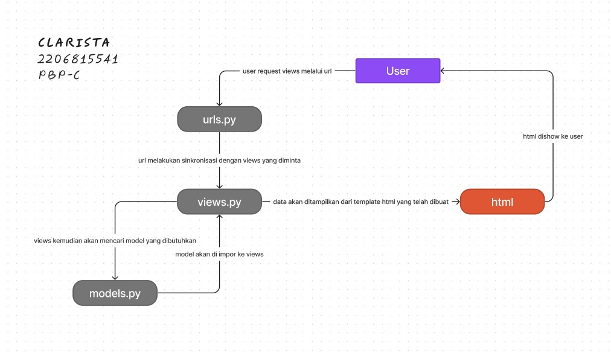

Aplikasi Stokbox: https://clarista-stokbox.adaptable.app/main/ (maaf ibu dan kakak asdos, kemarin udah sempet deploy tapi akun saya disable T_T)

1. Jelaskan bagaimana cara kamu mengimplementasikan checklist di atas secara step-by-step (bukan hanya sekadar mengikuti tutorial).
    -   Membuat sebuah proyek Django baru.
        Untuk membuat sebuah proyek Django, pertama-tama yang harus saya lakukan adalah membuat sebuah direktori baru. Disini saya menamakan direktori saya dengan nama "Stokbox". Kemudian kita harus membuka Terminal Command Prompt dan membuat serta mengaktifkan virtual environment. Setelah itu pada direktori yang sama, yaitu pada "Stokbox" kita buat file requirements.txt dan tambahkan beberapa instalasi untuk deployment aplikasi, termasuk Django salah satunya.

    -   Membuat aplikasi dengan nama main pada proyek tersebut.
        Pada proyek Stokbox yang telah saya buat sebelumnya, disini saya kemudian membuat aplikasi dengan nama main yaitu dengan cara menjalankan perintah "python manage.py startapp main".

    -   Melakukan routing pada proyek agar dapat menjalankan aplikasi main.  
        Untuk mendaftarkan dan menjalankan aplikasi main ke dalam proyek saya menambahkan main di INSTALLED_APPS pada file settings.py.

    -   Membuat model pada aplikasi main dengan nama Item dan memiliki atribut wajib sebagai berikut.
    name sebagai nama item dengan tipe CharField.
    amount sebagai jumlah item dengan tipe IntegerField.
    description sebagai deskripsi item dengan tipe TextField.
        Disini kita mengubah file models.py di dalam direktori aplikasi main untuk mendefinisikan model-model baru. Kode yang ditambahkan ke dalam file adalah untuk mendefinisikan model "Product" dengan atribut seperti nama, amount, price, dan description.

    -   Membuat sebuah fungsi pada views.py untuk dikembalikan ke dalam sebuah template HTML yang menampilkan nama aplikasi serta nama dan kelas kamu.
        Dalam file views.py telah ditambahkan fungsi show_main yang berfungsi untuk merender tampilan main.html di templates. Dalam tampilan main.html, terdapat judul aplikasi, serta informasi nama, kelas, dan NPM yang diformat sesuai dengan variabel "nama," "kelas," dan "npm" yang tersedia dalam "context" yang ada pada fungsi show_main dalam file views.py.

    -   Membuat sebuah routing pada urls.py aplikasi main untuk memetakan fungsi yang telah dibuat pada views.py.
        Mengimpor fungsi show_main dari file views.py dalam direktori aplikasi main, dan kemudian membuat daftar urlpatterns yang akan terhubung ke fungsi show_main itu.

    -   Melakukan deployment ke Adaptable terhadap aplikasi yang sudah dibuat sehingga nantinya dapat diakses oleh teman-temanmu melalui Internet.
        Membuka website adaptable.io lalu memilih "Create new app", "Connect an Existing Repository", Connect dengan repositori yang telah dibuat. Misalnya punya saya bernama "Stokbox", kemudian pilih "Python App Template", dan "PostgreSQL". Setelah itu saya menyesuaikan versi python dan menambah Start Command yaitu "python manage.py migrate && gunicorn Stokbox.wsgi". Lalu saya mmemberikan nama aplikasi, mencentang "HTTP Listener on PORT", dan mendeploy aplikasi.

2. Buatlah bagan yang berisi request client ke web aplikasi berbasis Django beserta responnya dan jelaskan pada bagan tersebut kaitan antara urls.py, views.py, models.py, dan berkas html.

3. Jelaskan mengapa kita menggunakan virtual environment? Apakah kita tetap dapat membuat aplikasi web berbasis Django tanpa menggunakan virtual environment?
    Kita menggunakan virtual environment ketika sebuah proyek membutuhkan beberapa versi Python atau third-party packages atau dependencies sekaligus, sebagai contoh adalah proyek-proyek Django. Untuk mencegah setiap proyek saling mempengengaruhi satu sama lain, maka dibutuhkan virtual environment ketika dijalankan.

    Kita tetap dapat membuat aplikasi web berbasis Django tanpa menggunakan virtual environment, tetapi lebih disarankan untuk menggunakan virtual environment karena membantu memiliki environment yang stabil, dapat direproduksi, dan portabel. Mengisolasi environment Python untuk suatu proyek dari sistem lainnya memastikan bahwa ketergantungan untuk setiap proyek konsisten dan dapat dengan mudah diduplikat jika menggunakan environment yang berbeda.

4. Jelaskan apakah itu MVC, MVT, MVVM dan perbedaan dari ketiganya.
    -   Model View Controller (MVC):
        MVC adalah software design pattern yang memisahkan aplikasi menjadi tiga komponen utama: Model, View, dan Controller. (Model dalam aplikasi web e-commerce, model dapat mewakili produk, pelanggan, dan pesanan. View menampilan data dan interaksi dengan pengguna, diambil dari model. Controller menjadi penghubung antara model dan view. Ini menerima input dari pengguna melalui view, memprosesnya, dan memperbarui model jika diperlukan).

    -   Model View Template (MVT):
        MVT tidak berbeda jauh dengan MVC, tetapi digunakan secara khusus dalam pengembangan aplikasi web dengan framework Django.(Memiliki model yang dapat mewakili tabel dalam database seperti model Produk. View akan berinteraksi dengan model dan menampilkan kepada user, tetapi tidak mencakup tampilan grafis. Template disini adalah kode html yang akan merender data dari view, dan akan menampilkan halaman web).

    -   Model View ViewModel
        Memiliki model dalam aplikasi web e-commerce, model dapat mewakili produk, pelanggan, dan pesanan. View menampilan data. Kemudian ViewModel itu mengambil data dari Model, memprosesnya, dan mempersiapkannya untuk ditampilkan di View.

    Kesimpulan: MVC, MVT, dan MVVM sama-sama bisa digunakan untuk pengembangan software. MVC umum digunakan dalam pengembangan web, MVT adalah varian Django, dan MVVM digunakan dalam aplikasi berbasis GUI.

Referensi:
https://www.javatpoint.com/django-virtual-environment-setup
https://ngangasn.com/is-virtualenv-venv-necessary-for-django/#google_vignette
https://www.geeksforgeeks.org/difference-between-mvc-and-mvt-design-patterns/
https://www.dicoding.com/blog/tips-design-pattern-mvvm/

    