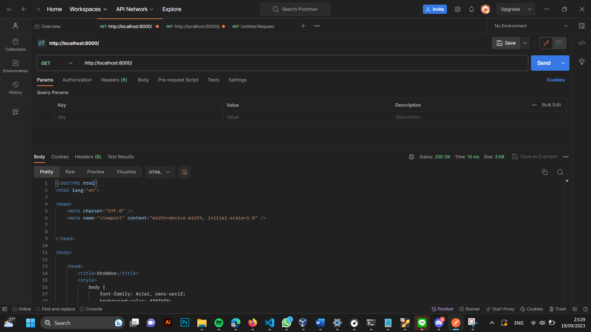
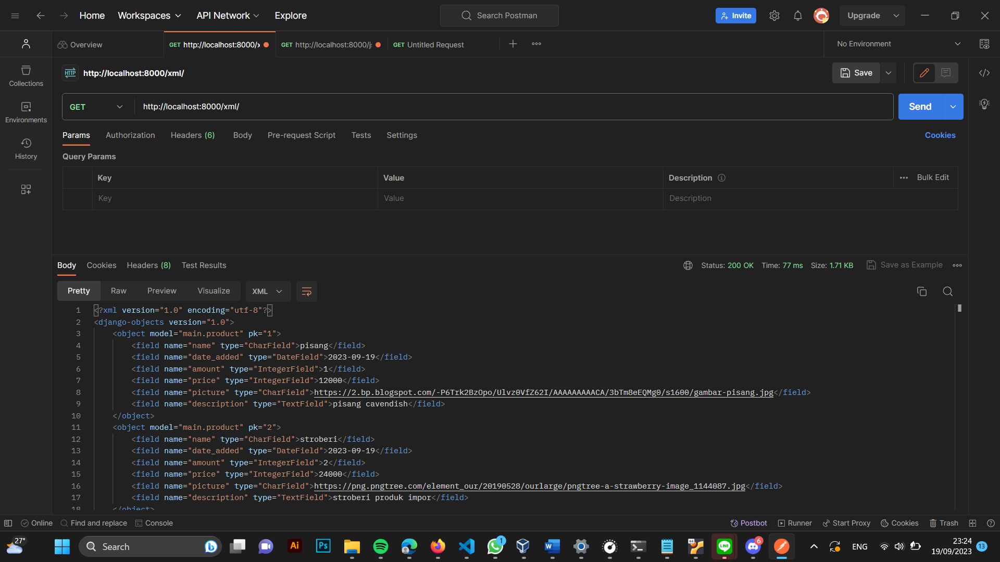
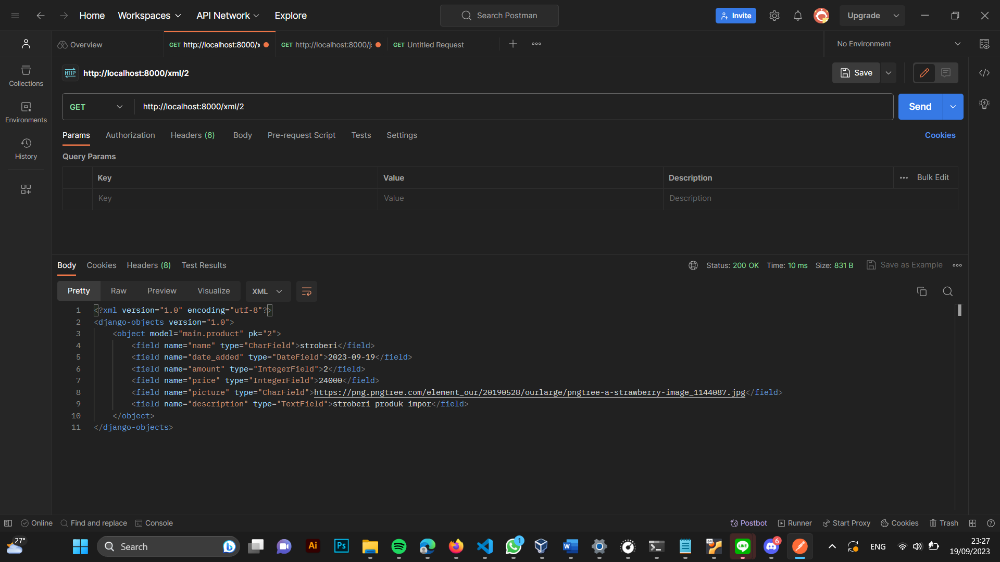
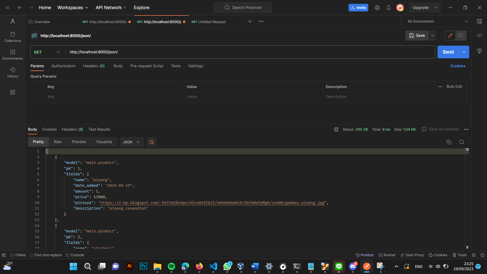
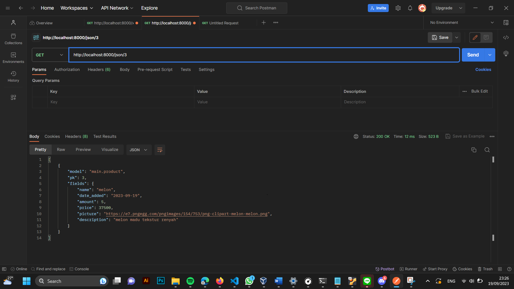

Nama    : Clarista
NPM     : 2206815541
Kelas   : PBP  C

Aplikasi Stokbox: https://clarista-stokbox.adaptable.app/main/ (maaf ibu dan kakak asdos, kemarin udah sempet deploy tapi akun saya disable T_T)

================================================ TUGAS 2 ========================================================

1. Jelaskan bagaimana cara kamu mengimplementasikan checklist di atas secara step-by-step (bukan hanya sekadar mengikuti tutorial).
    -   Membuat sebuah proyek Django baru.
        Untuk membuat sebuah proyek Django, pertama-tama yang harus saya lakukan adalah membuat sebuah direktori baru. Disini saya menamakan direktori saya dengan nama "Stokbox". Kemudian kita harus membuka Terminal Command Prompt dan membuat serta mengaktifkan virtual environment. Setelah itu pada direktori yang sama, yaitu pada "Stokbox" kita buat file requirements.txt dan tambahkan beberapa instalasi untuk deployment aplikasi, termasuk Django salah satunya.

    -   Membuat aplikasi dengan nama main pada proyek tersebut.
        Pada proyek Stokbox yang telah saya buat sebelumnya, disini saya kemudian membuat aplikasi dengan nama main yaitu dengan cara menjalankan perintah "python manage.py startapp main".

    -   Melakukan routing pada proyek agar dapat menjalankan aplikasi main.  
        Untuk mendaftarkan dan menjalankan aplikasi main ke dalam proyek saya menambahkan main di INSTALLED_APPS pada file settings.py.

    -   Membuat model pada aplikasi main dengan nama Item dan memiliki atribut wajib sebagai berikut.
    name sebagai nama item dengan tipe CharField.
    amount sebagai jumlah item dengan tipe IntegerField.
    description sebagai deskripsi item dengan tipe TextField.
        Disini kita mengubah file models.py di dalam direktori aplikasi main untuk mendefinisikan model-model baru. Kode yang ditambahkan ke dalam file adalah untuk mendefinisikan model "Product" dengan atribut seperti nama, amount, price, dan description.

    -   Membuat sebuah fungsi pada views.py untuk dikembalikan ke dalam sebuah template HTML yang menampilkan nama aplikasi serta nama dan kelas kamu.
        Dalam file views.py telah ditambahkan fungsi show_main yang berfungsi untuk merender tampilan main.html di templates. Dalam tampilan main.html, terdapat judul aplikasi, serta informasi nama, kelas, dan NPM yang diformat sesuai dengan variabel "nama," "kelas," dan "npm" yang tersedia dalam "context" yang ada pada fungsi show_main dalam file views.py.

    -   Membuat sebuah routing pada urls.py aplikasi main untuk memetakan fungsi yang telah dibuat pada views.py.
        Mengimpor fungsi show_main dari file views.py dalam direktori aplikasi main, dan kemudian membuat daftar urlpatterns yang akan terhubung ke fungsi show_main itu.

    -   Melakukan deployment ke Adaptable terhadap aplikasi yang sudah dibuat sehingga nantinya dapat diakses oleh teman-temanmu melalui Internet.
        Membuka website adaptable.io lalu memilih "Create new app", "Connect an Existing Repository", Connect dengan repositori yang telah dibuat. Misalnya punya saya bernama "Stokbox", kemudian pilih "Python App Template", dan "PostgreSQL". Setelah itu saya menyesuaikan versi python dan menambah Start Command yaitu "python manage.py migrate && gunicorn Stokbox.wsgi". Lalu saya mmemberikan nama aplikasi, mencentang "HTTP Listener on PORT", dan mendeploy aplikasi.

2. Buatlah bagan yang berisi request client ke web aplikasi berbasis Django beserta responnya dan jelaskan pada bagan tersebut kaitan antara urls.py, views.py, models.py, dan berkas html.

3. Jelaskan mengapa kita menggunakan virtual environment? Apakah kita tetap dapat membuat aplikasi web berbasis Django tanpa menggunakan virtual environment?
    - Kita menggunakan virtual environment ketika sebuah proyek membutuhkan beberapa versi Python atau third-party packages atau dependencies sekaligus, sebagai contoh adalah proyek-proyek Django. Untuk mencegah setiap proyek saling mempengengaruhi satu sama lain, maka dibutuhkan virtual environment ketika dijalankan.

    Kita tetap dapat membuat aplikasi web berbasis Django tanpa menggunakan virtual environment, tetapi lebih disarankan untuk menggunakan virtual environment karena membantu memiliki environment yang stabil, dapat direproduksi, dan portabel. Mengisolasi environment Python untuk suatu proyek dari sistem lainnya memastikan bahwa ketergantungan untuk setiap proyek konsisten dan dapat dengan mudah diduplikat jika menggunakan environment yang berbeda.

4. Jelaskan apakah itu MVC, MVT, MVVM dan perbedaan dari ketiganya.
    -   Model View Controller (MVC):
        MVC adalah software design pattern yang memisahkan aplikasi menjadi tiga komponen utama: Model, View, dan Controller. (Model dalam aplikasi web e-commerce, model dapat mewakili produk, pelanggan, dan pesanan. View menampilan data dan interaksi dengan pengguna, diambil dari model. Controller menjadi penghubung antara model dan view. Ini menerima input dari pengguna melalui view, memprosesnya, dan memperbarui model jika diperlukan).

    -   Model View Template (MVT):
        MVT tidak berbeda jauh dengan MVC, tetapi digunakan secara khusus dalam pengembangan aplikasi web dengan framework Django.(Memiliki model yang dapat mewakili tabel dalam database seperti model Produk. View akan berinteraksi dengan model dan menampilkan kepada user, tetapi tidak mencakup tampilan grafis. Template disini adalah kode html yang akan merender data dari view, dan akan menampilkan halaman web).

    -   Model View ViewModel
        Memiliki model dalam aplikasi web e-commerce, model dapat mewakili produk, pelanggan, dan pesanan. View menampilan data. Kemudian ViewModel itu mengambil data dari Model, memprosesnya, dan mempersiapkannya untuk ditampilkan di View.

    Kesimpulan: MVC, MVT, dan MVVM sama-sama bisa digunakan untuk pengembangan software. MVC umum digunakan dalam pengembangan web, MVT adalah varian Django, dan MVVM digunakan dalam aplikasi berbasis GUI.

Referensi:
1. https://www.javatpoint.com/django-virtual-environment-setup
2. https://ngangasn.com/is-virtualenv-venv-necessary-for-django/#google_vignette
3. https://www.geeksforgeeks.org/difference-between-mvc-and-mvt-design-patterns/
4. https://www.dicoding.com/blog/tips-design-pattern-mvvm/

============================================== END TUGAS 2 ======================================================

================================================ TUGAS 3 ========================================================
1.  Apa perbedaan antara form POST dan form GET dalam Django?
    - Di Django, kita bisa mengetahui ada perbedaan yang signifikan antara form POST dan form GET. Form POST digunakan untuk mengirimkan data yang nantinya akan mengubah server atau menyimpannya dalam database. Sedangkan, form GET digunakan untuk mengirimkan data dalam bentuk URL dan lebih cocok untuk operasi yang hanya ingin membaca tanpa mengubah server. Perbedaan utama di antara keduanya adalah bahwa form POST digunakan untuk mengirim data yang mungkin memengaruhi server dengan operasi selanjutnya, sedangkan form GET digunakan hanya untuk pengambilan data yang tidak memiliki pengaruh apapun pada server.

    Referensi:
    https://www.geeksforgeeks.org/render-html-forms-get-post-in-django/

2.  Apa perbedaan utama antara XML, JSON, dan HTML dalam konteks pengiriman data?
    - HTML digunakan untuk merancang tampilan dan struktur suatu halaman web, sedangkan XML dan JSON digunakan untuk menyimpan atau mengirim data antara aplikasi atau server. Perbedaan antara XML dan JSON terletak pada formatnya. JSON menggunakan tanda kurung kurawal ({}) dan memiliki struktur yang lebih mudah dibaca, sementara XML menggunakan tag awal dan akhir seperti HTML, tetapi lebih aman daripada JSON karena memungkinkan validasi struktur data.

    Referensi:
    https://www.deltaxml.com/blog/xml/whats-the-relationship-between-xml-json-html-and-the-internet/

3.  Mengapa JSON sering digunakan dalam pertukaran data antara aplikasi web modern?
    - JSON sering menjadi pilihan utama dalam pertukaran data antara aplikasi web modern. Hal ini karena JSON memiliki ukuran yang lebih kecil, sehingga lebih efisien dalam proses pengiriman data. Selain itu, format JSON lebih mudah dibaca oleh manusia, dan lebih kompatibel dengan tipe data asli, JavaScript, serta berbagai teknologi web lainnya. Kombinasi ini membuat JSON menjadi pilihan yang kuat untuk pertukaran data yang efisien dan kompatibel dengan berbagai platform.

    Referensi:
    https://aws.amazon.com/compare/the-difference-between-json-xml/

4.  Jelaskan bagaimana cara kamu mengimplementasikan checklist di atas secara step-by-step (bukan hanya sekadar mengikuti tutorial)
    - Membuat input form untuk menambahkan objek model pada app sebelumnya.  
    Pertama-tama, saya membuat sebuah python file yang bernama forms.py pada direktori main. Kemudian saya mengimport Modelform dari Django dan Product yang ada pada models, serta mengisi kerangka Form. Kemudian saya membuat sebuah function create_product di file views.py. Saya juga mebubah isi dari context di function show_main. Saya lalu menambahkan path pada urlpattern. Dan terakhir saya membuat file create_product.html di direktori templates di main untuk menambahkan produk ke database dan kemudian mengubah main.html untuk menampilkan produk ketika produk telah kita tambahkan.

    - Tambahkan 5 fungsi views untuk melihat objek yang sudah ditambahkan dalam format HTML, XML, JSON, XML by ID, dan JSON by ID. 
    Dalam implementasi format data seperti XML dan JSON, prosesnya memiliki beberapa kesamaan. Contohnya, untuk tampilan dalam format XML, langkah pertama adalah membuat fungsi "show_xml." Fungsi ini akan mengambil data dari Product dan menghasilkan respons dalam bentuk HttpResponse dengan format XML. Kemudian, di file konfigurasi "urls.py," saya menambahkan path URL "xml/" agar pengguna dapat mengakses data dalam format XML. Konsep yang sama berlaku untuk format JSON, dengan pembuatan fungsi "show_json" yang menghasilkan respons JSON setelah mengambil data dari objek "Item." Pengaturan path URL juga ditambahkan di "urls.py" untuk mengarahkan pengguna ke data dalam format JSON. Format "XML by ID" dan "JSON by ID" juga menggunakan pattern yang serupa dengan format XML dan JSON. Namun, fungsi-fungsi ini menerima parameter ID untuk menampilkan data yang spesifik sesuai dengan ID yang telah kita input. 

    - Membuat routing URL untuk masing-masing views yang telah ditambahkan pada poin 2.  
    Dalam file "urls.py," setiap format diperlakukan dengan langkah-langkah yang serupa. Pertama, di baris teratas, saya melakukan impor semua fungsi yang diperlukan untuk mengelola format-format tersebut. Fungsi-fungsi ini termasuk "show_main," "create_product," "show_xml," "show_json," "show_xml_by_id," dan "show_json_by_id." Selanjutnya, saya menambahkan path URL yang sesuai untuk masing-masing format tersebut dalam daftar urlspattern. Hal ini untuk memastikan bahwa user bisa mengakses setiap format dengan mudah melalui URL yang telah ditentukan. 

5.  Mengakses kelima URL di poin 2 menggunakan Postman, membuat screenshot dari hasil akses URL pada Postman, dan menambahkannya ke dalam README.md.

============================================== END TUGAS 3 ======================================================
